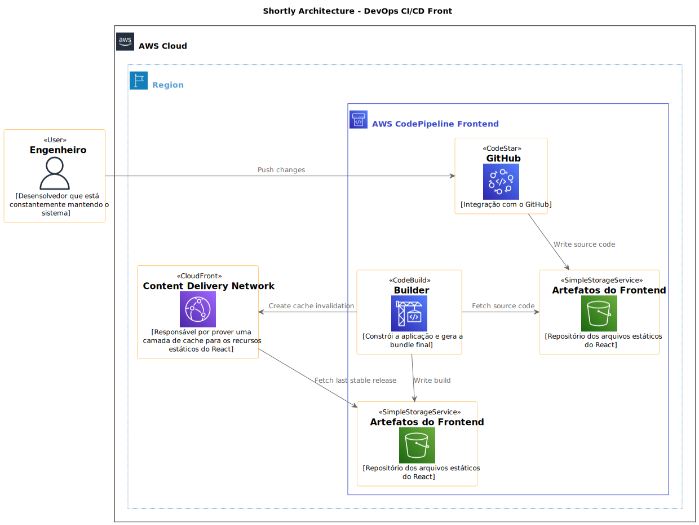
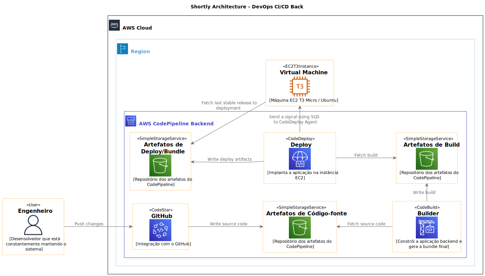
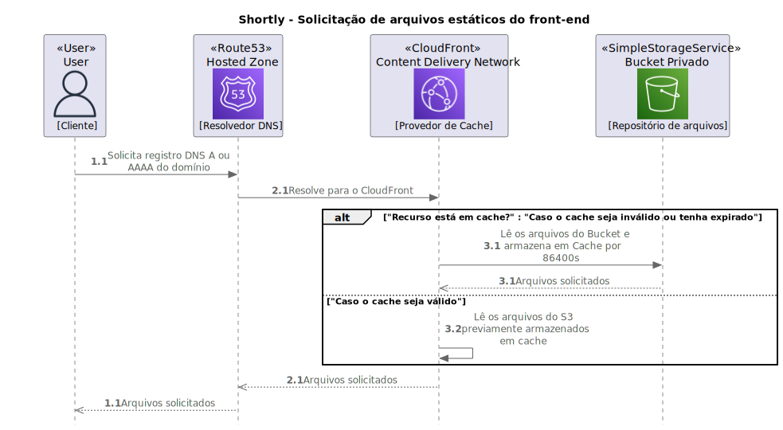

<h1 align="center">Shortly Infra-as-Code</h1>
<p align="center">
  
</p>
  <p align="center">
    
    
  </p>
<h2 align="center">
  This project was created using Terraform, Cloud Init and Amazon Web Services.
</h2>
<p align="center">
  This project is a Terraform infrastructure template for Amazon EC2 + Amazon RDS classic back-end architecture with Amazon CloudFront and Amazon S3 classic front-end architecture.
</p>
<p align="center">
   
  
  
  
</p>

## Architecture Overview

<p align="center">
  
</p>

<p align="center">
  
</p>

<p align="center">
  
</p>

## Metadata

```
Muryllo Pimenta – muryllo.pimenta@upe.br
```

Distributed under MIT license. See ``LICENSE`` for more informations.

## Contributing

1. Fork it (<https://github.com/MurylloEx/shortly-iac/fork>)
2. Create your feature branch (`git checkout -b feature/fooBar`)
3. Commit your changes (`git commit -am 'Add some fooBar'`)
4. Push to the branch (`git push origin feature/fooBar`)
5. Create a new Pull Request
